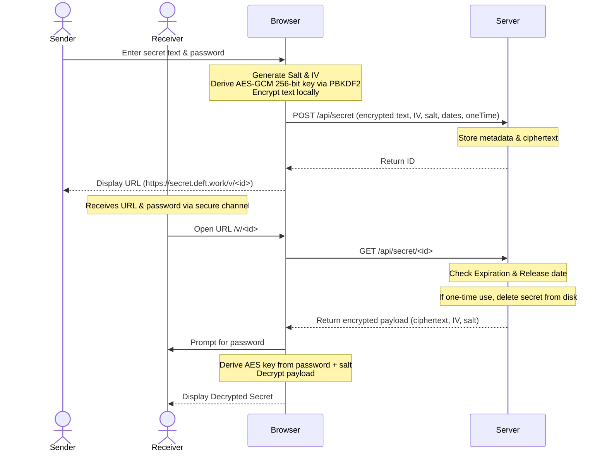

# DeftSecret 🔒

DeftSecret is a zero-knowledge, client-side encrypted secret sharing web application. It allows users to securely share confidential text (up to 1KB) with advanced settings like release-delay (start date), expiration (end date), and burn-after-reading (one-time use).

## 🛡️ Architecture & Security Model

The key priority of DeftSecret is zero-knowledge security. 



### Key Security Features
1. **Client-side Encryption:** Plaintext and passwords never leave the client's browser. Secret text is encrypted using **AES-GCM (256-bit)** with keys derived using **PBKDF2** (100,000 iterations of SHA-256) and a cryptographically secure random salt.
2. **Server Blindness:** Since only the encrypted ciphertext, salt, and IV are transmitted, the hosting server cannot read the secrets.
3. **One-Time Use (Burn After Reading):** One-time secrets are deleted from the server's disk instantly when fetched.
4. **Time-Locked Secrets (Release Date):** The server refuses to share the encrypted payload until the specified date/time has passed.
5. **Expiration Date:** Secrets are automatically deleted upon access if the expiration date has passed. A background daemon runs hourly on the server to clean up any unclaimed expired secrets.
6. **Strict Input Sanitization:** Plaintext size is strictly limited to 1KB. Identifiers are verified against strict regex patterns (`^[0-9a-f]{24}$`) to prevent directory traversal and injection.

---

## 🛠️ Stack & Technologies

* **Frontend:** Vanilla HTML5, Vanilla CSS3 (custom CSS design system with micro-animations & glassmorphic aesthetics), Vanilla JavaScript (native Web Crypto API).
* **Backend:** Node.js (Express), Native filesystem storage for zero-dependency portability.
* **Server & Proxy:** UWAS (Unified Web Application Server) with automatic Let's Encrypt HTTPS certificates.
* **Packaging:** Docker (`docker-compose` & Alpine Node base image).

---

## 🚀 Getting Started

### Prerequisites
* Docker and Docker Compose installed.

### Local Development & Execution
1. Clone the repository.
2. Spin up the container:
   ```bash
   docker-compose up -d --build
   ```
3. The application will be running at `http://localhost:5063` (mapped from container port `3000`).

---

## 📡 API Reference

### 1. Create Secret
* **Endpoint:** `POST /api/secret`
* **Request Body:**
  ```json
  {
    "encryptedText": "hex_encoded_ciphertext",
    "iv": "hex_encoded_iv",
    "salt": "hex_encoded_salt",
    "releaseDate": "ISO_DATE_STRING_OR_NULL",
    "expireDate": "ISO_DATE_STRING_OR_NULL",
    "oneTime": true
  }
  ```
* **Success Response (201 Created):**
  ```json
  {
    "id": "12-byte-hex-id-string"
  }
  ```

### 2. Retrieve Secret
* **Endpoint:** `GET /api/secret/:id`
* **Success Response (200 OK):**
  ```json
  {
    "encryptedText": "hex_encoded_ciphertext",
    "iv": "hex_encoded_iv",
    "salt": "hex_encoded_salt",
    "oneTime": true
  }
  ```
* **Error Responses:**
  * `403 Forbidden` - Secret is locked until `releaseDate`.
  * `404 Not Found` - Secret doesn't exist, has already been burned, or has expired.
  * `410 Gone` - Secret expired.
